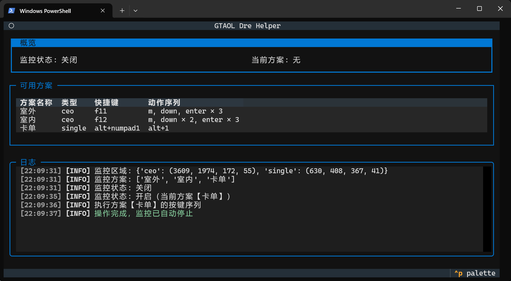
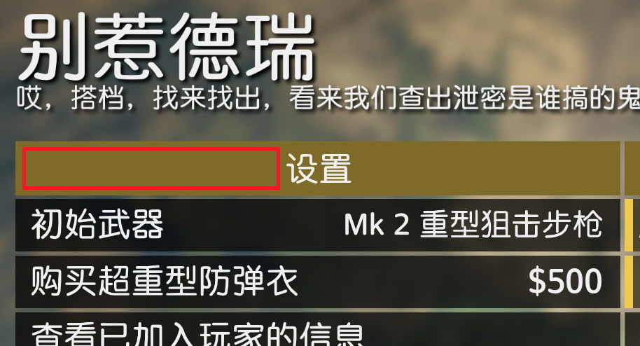

# GTAOL Dre Helper

这是一个帮助 GTA Online 玩家利用德瑞 bot 直接开“别惹德瑞”任务终章时自动执行“卡CEO“和“卡单”操作的小工具。



## 环境要求

- 操作系统：Windows 11 (x64)
- 终端：Windows Terminal
- GTA5 增强版（传承版未测试，如果游戏 UI 类似也许也能用）

## 功能

### 卡 CEO

开始匹配差事后，通过 OCR 识别屏幕右下角的文字，当检测到已加入人数 >=2 时，自动执行预设的按键操作注册为 CEO。

### 卡单

加入 bot 的房间进入任务准备页面后，通过检查指定区域颜色的方式判断菜单是否消失，检测到菜单消失时，自动执行预设的按键操作触发小红帽（[QuellGTA](https://www.mageangela.cn/QuellGTA/)）的自动卡单功能。

## 安装

1. 前往 [Release 页面](https://github.com/andywang425/gtaol-dre-helper/releases/latest)，下载 `gtaol-dre-helper.7z`。
2. 解压 `gtaol-dre-helper.7z` 到任意目录。
3. 编辑其中的 `config.yaml` 配置文件。过程中可能会用到 `RegionLocator.exe` 辅助定位 OCR/颜色 识别区域。

<details>
<summary> 从源代码运行（点击展开）</summary>

1. 安装 Python 3.14+ 和 [uv](https://docs.astral.sh/uv/)
2. 克隆仓库到本地
   ```powershell
   git clone https://github.com/andywang425/gtaol-dre-helper.git
   ```
3. 进入项目根目录
   ```powershell
   cd gtaol-dre-helper
   ```
4. 创建虚拟环境
   ```powershell
   uv venv --python 3.14
   ```
5. 安装依赖
   ```powershell
   uv sync --group dev
   ```
6. 复制示例配置文件
   ```powershell
   Copy-Item config.example.yaml config.yaml
   ```
7. 准备 OCR 所需的 [Tesseract](https://github.com/UB-Mannheim/tesseract/releases/latest)

   可以从 Release 包中把整个 `tesseract` 目录复制过来，这是经过精简后的 `Tesseract`，删除了非必要的文件

8. 按需修改 `config.yaml`
9. 启动程序

   ```powershell
   uv run python main.py
   ```

   或者先激活虚拟环境再直接运行

   ```powershell
   .venv\Scripts\activate
   python main.py
   ```

   如果要调试代码，建议先启动 Textual 控制台

   ```powershell
   .\console
   ```

   然后以开发模式运行

   ```powershell
   .\dev
   ```

</details>

## 配置项说明（`config.yaml`）

完整结构如下：

```yaml
# 识别区域
# 单位：屏幕像素
# x, y: 矩形左上角坐标
# width, height: 矩形宽高
region:
  # OCR 识别区域
  # 程序会截图这个矩形区域识别“已加入人数/人数上限”
  #
  # 全屏游戏时各屏幕分辨率推荐设置：
  # 4k (3840x2160): x=3609, y=1974, width=172, height=55
  # 2k (2560x1440): x=2409, y=1314, width=105, height=37
  # 1080p (1920x1080): x=1807, y=986, width=78, height=27
  ceo:
    x: 3609
    y: 1974
    width: 172
    height: 55

  # 卡单识别区域
  # 程序会获取这区域内像素的颜色值，判断菜单是否消失
  #
  # 全屏游戏时各屏幕分辨率推荐设置：
  # 4k (3840x2160): x=630, y=408, width=367, height=41
  # 2k (2560x1440): x=420, y=272, width=244, height=27
  # 1080p (1920x1080): x=315, y=204, width=183, height=20
  single:
    x: 630
    y: 408
    width: 367
    height: 41

# 监控方案
# 每个方案包含一个名称 (name)、一个类型 (type)、一个开关键 (toggle_key) 和一个按键序列 (sequence)
# 开关键 (toggle_key)：以当前方案开始监控/停止监控/切换到当前方案，也支持用 '+' 连接组合键，如 'ctrl+f11'
# 类型 (type)：ceo（卡CEO） 或 single（卡单）
# 按键序列 (sequence)：包含多个按键操作
# 每个按键操作包含一个按键 (key)、一个按住时间 (hold)、一个组合键间隔时间 (interval)、一个延迟时间 (delay) 和一个执行次数 (times)
# 按键 (key)：支持 'm', 'enter', 'up', 'down' 等，也支持用 '+' 连接组合键，如 'ctrl+c'
# 按住时间：按键保持按下的时间（单位秒，默认值为 0.05）
# 组合键间隔时间：组合键中每个按键之间的间隔时间（单位秒，默认值为 0.05），等所有键被按下后才开始计算按住时间
# 延迟时间：每次按键之后等待的时间（单位秒，默认值为 0.1）
# 执行次数：按键操作执行的次数（默认值为 1）
profiles:
  - name: 室外
    type: ceo
    toggle_key: "f11"
    sequence:
      - key: "m" # 打开菜单
        delay: 0.18
      - key: "down" # 向下移动一次
        delay: 0.06
      - key: "enter" # 连续确认三次
        delay: 0.06
        times: 3

  - name: 室内
    type: ceo
    toggle_key: "f12"
    sequence:
      - key: "m" # 打开菜单
        delay: 0.18
      - key: "down" # 向下移动两次
        delay: 0.06
        times: 2
      - key: "enter" # 连续确认三次
        delay: 0.06
        times: 3

  - name: 卡单
    type: single
    toggle_key: "alt+numpad1"
    sequence:
      # 小红帽的卡单快捷键（流程详解：先按住 alt 0.5 秒，然后 alt+1 一起按住 0.5 秒，最后立刻全部松开）
      # 小红帽热键引擎模式说明：本软件不支持代理模式，仅支持直连模式和轮询模式
      # 如果开了轮询模式，请将 hold 和 interval 调大一点 （建议至少 0.5 秒），否则可能无法触发快捷键
      - key: "alt+1"
        hold: 0.5
        interval: 0.5
```

<details>
  <summary> toggle_key 支持的按键（点击展开）</summary>

- 支持单键，也支持使用 `+` 连接组合键，例如 `f11`、`ctrl+f11`、`alt+numpad1`
- 不区分大小写，程序会自动规范化为小写，例如 `Ctrl+F11` 会被当成 `ctrl+f11`
- 同一个组合键里不能出现重复按键，例如 `ctrl+ctrl+f11` 不合法
- 支持以下标准名称：

| 分类       | 支持的按键                                                                                       |
| ---------- | ------------------------------------------------------------------------------------------------ |
| 字母       | `a` \~ `z`                                                                                       |
| 数字       | `0` \~ `9`                                                                                       |
| 功能键     | `f1` \~ `f24`                                                                                    |
| 修饰键     | `shift`、`ctrl`、`alt`                                                                           |
| 常用控制键 | `backspace`、`tab`、`enter`、`pause`、`capslock`、`esc`、`space`                                 |
| 导航键     | `pageup`、`pagedown`、`home`、`end`、`left`、`up`、`right`、`down`、`insert`、`delete`           |
| 小键盘     | `numpad0` \~ `numpad9`、`numpad_mul`、`numpad_add`、`numpad_sub`、`numpad_decimal`、`numpad_div` |

- 也支持以下别名，程序会自动转换为右侧标准名称：

| 别名           | 标准名称               |
| -------------- | ---------------------- |
| `control`      | `ctrl`                 |
| `return`       | `enter`                |
| `escape`       | `esc`                  |
| `del`          | `delete`               |
| `ins`          | `insert`               |
| `pgup`         | `pageup`               |
| `pgdn`         | `pagedown`             |
| `kp0` \~ `kp9` | `numpad0` \~ `numpad9` |
| `num_mul`      | `numpad_mul`           |
| `num_add`      | `numpad_add`           |
| `num_sub`      | `numpad_sub`           |
| `num_decimal`  | `numpad_decimal`       |
| `num_div`      | `numpad_div`           |

</details>

<details>
  <summary> sequence.key 支持的按键（点击展开）</summary>

- 支持单键，也支持使用 `+` 连接组合键，例如 `m`、`enter`、`ctrl+c`、`alt+1`
- 不区分大小写，程序会自动规范化为小写，例如 `Alt+1` 会被当成 `alt+1`
- 组合键中的按键会按书写顺序依次按下，全部按下后再开始计算 `hold`
- 支持的按键范围与 `toggle_key` 基本一致，但 **不支持** **`pause`**
- 支持以下标准名称：

| 分类       | 支持的按键                                                                                       |
| ---------- | ------------------------------------------------------------------------------------------------ |
| 字母       | `a` \~ `z`                                                                                       |
| 数字       | `0` \~ `9`                                                                                       |
| 功能键     | `f1` \~ `f24`                                                                                    |
| 修饰键     | `shift`、`ctrl`、`alt`                                                                           |
| 常用控制键 | `backspace`、`tab`、`enter`、`capslock`、`esc`、`space`                                          |
| 导航键     | `pageup`、`pagedown`、`home`、`end`、`left`、`up`、`right`、`down`、`insert`、`delete`           |
| 小键盘     | `numpad0` \~ `numpad9`、`numpad_mul`、`numpad_add`、`numpad_sub`、`numpad_decimal`、`numpad_div` |

- 同样支持下面这些别名，写法和 `toggle_key` 一样：

| 别名           | 标准名称               |
| -------------- | ---------------------- |
| `control`      | `ctrl`                 |
| `return`       | `enter`                |
| `escape`       | `esc`                  |
| `del`          | `delete`               |
| `ins`          | `insert`               |
| `pgup`         | `pageup`               |
| `pgdn`         | `pagedown`             |
| `kp0` \~ `kp9` | `numpad0` \~ `numpad9` |
| `num_mul`      | `numpad_mul`           |
| `num_add`      | `numpad_add`           |
| `num_sub`      | `numpad_sub`           |
| `num_decimal`  | `numpad_decimal`       |
| `num_div`      | `numpad_div`           |

</details>

## 使用方法

1. 双击运行 `gtaol-dre-helper.exe`。
2. 游戏中打开手机，选择快速加入，开始匹配差事。
3. 按某个卡 CEO 方案对应的开关键（默认室外 `f11` , 室内 `f12`）以该方案开启监控。
4. 当匹配到差事并且已加入人数 >=2 时，程序会执行当前方案的动作序列。执行完成后监控自动停止。
   > 如果长时间匹配不到差事弹出了”注意“警告，或者匹配到差事之后秒进了，请手动退出来打开手机重新匹配。
5. 进入任务准备页面后，按下某个卡单方案对应的开关键（默认 `alt+小键盘数字1`）以该方案开启监控。
6. 当菜单消失时，程序会执行当前方案的动作序列，触发小红帽的自动卡单功能。执行完成后监控自动停止。
7. 最后正常完成任务即可。

## 定位 OCR/颜色 识别区域

如果需要定位 OCR/颜色 识别区域，可使用 `RegionLocator.exe` 辅助工具。

### OCR 识别区域示例

红色矩形是你需要手动定位的区域：


定位方法：首先进游戏匹配差事，像示例中那样匹配到差事后，全屏截图。运行 `RegionLocator.exe`，以全屏的方式打开这张截图，然后根据软件提示定位矩形识别区域区域。定位需要准确，不能太多（比如把左侧差事名称包含进去），也不能太少（注意”已加入人数”和“人数上限”这两个数都可能为两位数）。

### 颜色识别区域示例

红色矩形是你需要手动定位的区域：

> 其实也可以选取别的区域，只要你选的区域是纯色的且菜单消失时会一并消失即可



定位方法：在任务准备页面全屏截图。运行 `RegionLocator.exe`，以全屏的方式打开这张截图，然后根据软件提示定位矩形识别区域区域。

## 注意

本程序会频繁获取屏幕截图，注册为 CEO 和卡单时会模拟键盘按键。这两个操作底层都是通过win32 API实现的。可能存在风险，介意勿用。

> 我个人认为风险不大，因为本程序没有任何直接读写游戏数据的操作（截图也是屏幕截图而不是获取游戏窗口画面）

## 相关推荐

### [QuellGTA](https://www.mageangela.cn/QuellGTA/)

建议搭配 QuellGTA（小红帽）一起用，本程序的卡单功能依赖于小红帽的自动卡单功能。
